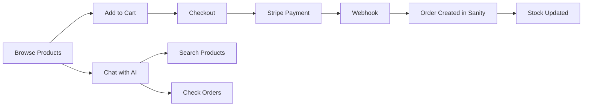
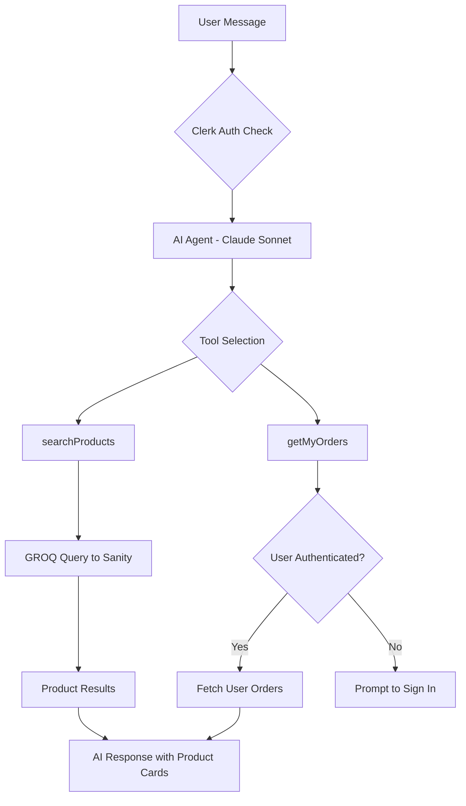
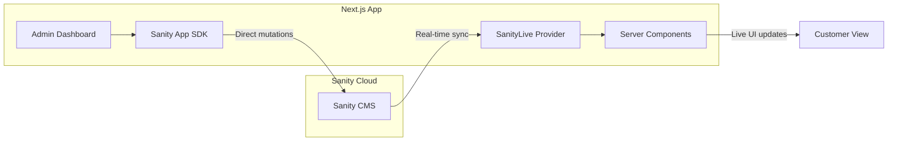

<!-- Badges -->
<div align="center">

[](https://creativecommons.org/licenses/by-nc/4.0/)
[](https://nextjs.org/)
[](https://react.dev/)
[](https://www.sanity.io/)
[](https://clerk.com/)
[](https://stripe.com/)
[](https://www.anthropic.com/)

</div>

# 🛋️ AI-Powered E-commerce Platform with Real-time Content

> Build a modern furniture e-commerce store with an AI shopping assistant, real-time inventory updates, and a powerful admin dashboard — all powered by cutting-edge technologies.

<div align="center">

| 👥 **Who It's For** | ⚡ **Key Differentiators** | 🔧 **Technical Highlights** |
|:---:|:---:|:---:|
| Developers learning modern full-stack patterns with AI integration | **Sanity App SDK** for real-time data & **Clerk AgentKit** for authenticated AI tools | Claude AI shopping assistant, live inventory updates, Stripe checkout |

</div>

---

## 👇🏼 DO THIS Before You Get Started

Use THESE links to set up your accounts (It's a special affiliate link which lets us continue to do builds like this FREE for you!):

- [**Get Started with Sanity →**](https://www.sanity.io/sonny?utm_source=youtube&utm_medium=video&utm_content=ai-ecommerce-platform)
- [**Get Started with Clerk →**](https://go.clerk.com/uc48FAP)

| Service | Description | ‼️ LINK TO USE ‼️ |
|---------|-------------|------|
| 🧡 **Sanity** | Headless CMS with real-time capabilities & App SDK | [**Get Started with Sanity →**](https://www.sanity.io/sonny?utm_source=youtube&utm_medium=video&utm_content=ai-ecommerce-platform) |
| 💜 **Clerk** | Authentication with AgentKit for AI context | [**Get Started with Clerk →**](https://go.clerk.com/uc48FAP) |

---

## 🤔 What Is This App?

**Think of it as a furniture store with a brain.**

This is a full-featured e-commerce platform where customers can:

- 🛒 **Browse & Buy** — Shop premium furniture with real-time stock updates
- 🤖 **Chat with AI** — Ask the AI assistant to find products, check prices, or track orders
- 📦 **Track Orders** — View order history and delivery status (when signed in)

And store owners get:

- 📊 **AI-Powered Insights** — Dashboard with sales trends, inventory alerts, and action items
- ✏️ **Real-time Editing** — Manage products and orders with instant updates via Sanity App SDK
- 🔔 **Smart Alerts** — Low stock warnings and unfulfilled order notifications

### Key Concepts Explained

| Term | What It Means |
|------|---------------|
| **CMS (Content Management System)** | Where all your products, orders, and content live — in this case, Sanity |
| **Real-time Content** | When you update a product in Sanity, it instantly appears on the website |
| **AI Shopping Assistant** | A chatbot powered by Claude AI that can search products and check your orders |
| **App SDK** | Sanity's toolkit for building custom applications with direct database access |

---

## 🎯 What You'll Learn

✅ **Next.js 16** with App Router & Server/Client Components + Server Actions!

✅ **Clerk authentication** with AgentKit for AI-aware user context!

✅ **Sanity CMS** with App SDK for real-time data mutations & live content updates!

✅ **Vercel AI SDK** with AI Gateway for multi-provider LLM support (Claude, GPT, Cohere)!

✅ **Stripe payments** with webhooks for secure checkout & order processing!

✅ **shadcn/ui + Tailwind CSS v4** for beautiful, accessible UI components!

✅ **Zustand state management** with localStorage persistence for cart!

✅ **Mobile-responsive design** with modern layouts & dark mode!

✅ **AI Shopping Assistant** with custom tools for product search & order tracking!

✅ **AI Admin Dashboard** with Claude-powered insights, sales trends & recommendations!

✅ **GROQ queries** with TypeGen for type-safe Sanity data fetching!

✅ **Real-time UI updates** via Sanity Live — no polling required!

✅ **Custom AI tools** scoped to authenticated users (orders only visible when signed in)!

✅ **Webhook-driven order creation** with automatic stock management!

✅ **Embedded Sanity Studio** for content management at `/studio`! + SO MUCH MORE!

---

## 🚀 Before We Dive In - Join the PAPAFAM!

**Want to build apps like this from scratch?**

Join thousands of developers learning to build production-ready applications with the latest technologies.

### PAPAFAM Community Benefits

- 🎓 Step-by-step video tutorials
- 💬 Private Discord community
- 🔥 Weekly coding challenges
- 📁 Access to all project source code
- 🏆 Certificate of completion

### Real Results

> "I landed my first developer job after completing the PAPAFAM course!" — Community Member

<div align="center">

### [🎯 Join the PAPAFAM Course →](https://www.papareact.com/course)

</div>

---

## ✨ Features

### For Shoppers

| Feature | Description |
|---------|-------------|
| 🤖 **AI Shopping Assistant** | Natural language product search, filter by material/color/price, get recommendations |
| 📦 **Order Tracking** | View your order history and status (requires sign-in) |
| 🛒 **Smart Cart** | Persistent cart with real-time stock validation |
| 💳 **Secure Checkout** | Stripe-powered payments with address collection |
| 🔄 **Real-time Stock** | See live inventory levels — no surprises at checkout |

### For Admins

| Feature | Description |
|---------|-------------|
| 🧠 **AI Dashboard Insights** | Sales trends, inventory alerts, and actionable recommendations powered by Claude |
| 📝 **Product Management** | Create, edit, and publish products directly via Sanity App SDK |
| 📋 **Order Management** | Update order status (paid → shipped → delivered) |
| ⚠️ **Low Stock Alerts** | Automatic warnings when inventory runs low |
| 📊 **Analytics** | Revenue tracking, order counts, and performance metrics |

### Technical Features (The Smart Stuff)

| Feature | Technology | Why It Matters |
|---------|------------|----------------|
| ⚡ **Real-time Updates** | Sanity Live + App SDK | Content changes appear instantly without refresh |
| 🔐 **Authenticated AI** | Clerk AgentKit | AI assistant knows who you are and can access YOUR orders |
| 🧠 **AI Gateway** | Vercel AI Gateway | Use Claude, GPT, or other models — easily swappable |
| 🛒 **Persisted Cart** | Zustand + localStorage | Cart survives page refreshes and browser restarts |
| 📱 **Responsive Design** | Tailwind CSS + Shadcn/UI | Beautiful UI on any device |
| ⚙️ **Type Safety** | TypeScript + Sanity TypeGen | Auto-generated types from your CMS schema |

---

## 🔄 How It Works

### User Shopping Flow



### AI Assistant Architecture



### Real-time Data Flow



---

## 🚀 Getting Started

### Prerequisites

Before you begin, ensure you have:

- **Node.js 18+** — [Download here](https://nodejs.org/)
- **pnpm** — Install with `npm install -g pnpm`
- **Sanity Account** — [Create free account](https://www.sanity.io/sonny?utm_source=youtube&utm_medium=video&utm_content=ai-ecommerce-platform)
- **Clerk Account** — [Create free account](https://go.clerk.com/uc48FAP)
- **Stripe Account** — [Create account](https://stripe.com/)
- **Vercel Account** — For AI Gateway access

### Step-by-Step Setup

#### 1. Clone the Repository

```bash
git clone https://github.com/sonnysangha/ai-ecommerce-sanity-clerk.git
cd ai-ecommerce-sanity-clerk
```

#### 2. Install Dependencies

```bash
pnpm install
```

#### 3. Set Up Environment Variables

```bash
cp .env.example .env.local
```

Then fill in your values:

```bash
# Sanity
NEXT_PUBLIC_SANITY_PROJECT_ID=Your_value_goes_here
NEXT_PUBLIC_SANITY_DATASET=Your_value_goes_here
NEXT_PUBLIC_SANITY_ORG_ID=Your_value_goes_here
SANITY_API_WRITE_TOKEN=Your_value_goes_here

# Clerk
NEXT_PUBLIC_CLERK_PUBLISHABLE_KEY=Your_value_goes_here
CLERK_SECRET_KEY=Your_value_goes_here

# Stripe
STRIPE_SECRET_KEY=Your_value_goes_here
# stripe listen --forward-to localhost:3000/api/webhooks/stripe
STRIPE_WEBHOOK_SECRET=Your_value_goes_here

# Vercel
AI_GATEWAY_API_KEY=Your_value_goes_here
```

> ⚠️ **Security Note**: Never commit `.env.local` to git. The `.gitignore` already excludes it.

> 💡 **Tip**: Variables starting with `NEXT_PUBLIC_` are exposed to the browser. Keep sensitive keys (like `CLERK_SECRET_KEY`) without this prefix.

#### 4. Configure Sanity

1. Go to [sanity.io/manage](https://www.sanity.io/manage)
2. Create a new project or select existing
3. Copy your **Project ID** and **Dataset** name
4. Create an API token with **Editor** permissions for `SANITY_API_WRITE_TOKEN`

#### 5. Configure Clerk

1. Go to [dashboard.clerk.com](https://dashboard.clerk.com/)
2. Create a new application
3. Copy your **Publishable Key** and **Secret Key**

#### 6. Configure Stripe

1. Go to [dashboard.stripe.com/apikeys](https://dashboard.stripe.com/apikeys)
2. Copy your **Secret Key** (starts with `sk_test_` for development)
3. For webhooks, run the Stripe CLI:

```bash
stripe listen --forward-to localhost:3000/api/webhooks/stripe
```

4. Copy the webhook signing secret it provides

#### 7. Configure AI Gateway

1. Go to [vercel.com](https://vercel.com/) and navigate to AI Gateway
2. Create an API key
3. The app uses Claude Sonnet 4/4.5 by default, but you can swap to other providers

> 💡 **Swappable Models**: The AI Gateway supports OpenAI, Anthropic, Cohere, and more. Check `lib/ai/shopping-agent.ts` to change models.

#### 8. Generate Types & Import Data

```bash
# Generate TypeScript types from Sanity schema
pnpm typegen

# Import sample furniture data
npx sanity dataset import sample-data.ndjson
```

#### 9. Start Development Server

```bash
pnpm dev
```

Open [http://localhost:3000](http://localhost:3000) — you're ready to go! 🎉

### First Time Setup Checklist

- [ ] All environment variables filled in `.env.local`
- [ ] Sanity project created with dataset
- [ ] Clerk application created
- [ ] Stripe CLI running for local webhooks
- [ ] Sample data imported
- [ ] Types generated with `pnpm typegen`

---

## 📊 Database Schema Overview

This app uses **Sanity** as its headless CMS with the following document types:

### Product

| Field | Type | Description |
|-------|------|-------------|
| `name` | string | Product name |
| `slug` | slug | URL-friendly identifier |
| `description` | text | Product description |
| `price` | number | Price in GBP |
| `category` | reference | Link to category |
| `material` | string | wood, metal, fabric, leather, glass |
| `color` | string | black, white, oak, walnut, grey, natural |
| `dimensions` | string | e.g., "120cm x 80cm x 75cm" |
| `stock` | number | Current inventory count |
| `images` | array | Product images with hotspot |
| `featured` | boolean | Show in featured carousel |

### Category

| Field | Type | Description |
|-------|------|-------------|
| `title` | string | Category name |
| `slug` | slug | URL-friendly identifier |
| `description` | text | Category description |
| `image` | image | Category thumbnail |

### Order

| Field | Type | Description |
|-------|------|-------------|
| `orderNumber` | string | Unique order ID (e.g., ORD-ABC123) |
| `items` | array | Products with quantity and price at purchase |
| `total` | number | Order total in GBP |
| `status` | string | pending, paid, shipped, delivered, cancelled |
| `customer` | reference | Link to customer record |
| `clerkUserId` | string | Clerk user identifier |
| `email` | string | Customer email |
| `address` | object | Shipping address |
| `stripePaymentId` | string | Stripe payment intent ID |

### Customer

| Field | Type | Description |
|-------|------|-------------|
| `name` | string | Customer name |
| `email` | string | Customer email |
| `clerkUserId` | string | Clerk user identifier |
| `stripeCustomerId` | string | Stripe customer ID |

---

## 🔧 Key Technical Patterns

### Sanity App SDK Patterns

The admin dashboard uses Sanity App SDK for direct document operations:

```typescript
// app/(admin)/admin/page.tsx
import {
  useApplyDocumentActions,
  createDocumentHandle,
  createDocument,
} from "@sanity/sdk-react";

// Create a new product
const apply = useApplyDocumentActions();

const handleCreateProduct = async () => {
  const newDocHandle = createDocumentHandle({
    documentId: crypto.randomUUID(),
    documentType: "product",
  });
  await apply(createDocument(newDocHandle));
  router.push(`/admin/inventory/${newDocHandle.documentId}`);
};
```

**Key hooks used:**
- `useDocuments()` — Reactive document queries
- `useApplyDocumentActions()` — Perform mutations (create, update, delete)
- `createDocumentHandle()` — Create handles for new documents

### Clerk AgentKit Pattern

The AI assistant uses Clerk to provide user context:

```typescript
// lib/ai/shopping-agent.ts
export function createShoppingAgent({ userId }: { userId: string | null }) {
  const isAuthenticated = !!userId;

  // Tools vary based on authentication
  const tools: Record<string, Tool> = {
    searchProducts: searchProductsTool, // Always available
  };

  // Only add orders tool if user is signed in
  if (isAuthenticated) {
    tools.getMyOrders = createGetMyOrdersTool(userId);
  }

  return new ToolLoopAgent({
    model: gateway("anthropic/claude-sonnet-4.5"),
    instructions: isAuthenticated ? fullInstructions : guestInstructions,
    tools,
  });
}
```

**How it works:**
1. Clerk provides `userId` from the session
2. Agent is created with user-specific tools
3. `getMyOrders` tool is scoped to that user's data

### Custom AI Tools

#### searchProducts Tool

```typescript
// lib/ai/tools/search-products.ts
export const searchProductsTool = tool({
  description: "Search for products in the furniture store",
  inputSchema: z.object({
    query: z.string().optional(),
    category: z.string().optional(),
    material: z.enum(["", "wood", "metal", "fabric", "leather", "glass"]),
    color: z.enum(["", "black", "white", "oak", "walnut", "grey", "natural"]),
    minPrice: z.number().optional(),
    maxPrice: z.number().optional(),
  }),
  execute: async (params) => {
    // Executes GROQ query against Sanity
    const { data: products } = await sanityFetch({
      query: AI_SEARCH_PRODUCTS_QUERY,
      params,
    });
    return { products, found: products.length > 0 };
  },
});
```

#### getMyOrders Tool

```typescript
// lib/ai/tools/get-my-orders.ts
export function createGetMyOrdersTool(userId: string | null) {
  if (!userId) return null; // Not available for guests

  return tool({
    description: "Get the current user's orders",
    inputSchema: z.object({
      status: z.enum(["", "pending", "paid", "shipped", "delivered"]).optional(),
    }),
    execute: async ({ status }) => {
      const { data: orders } = await sanityFetch({
        query: ORDERS_BY_USER_QUERY,
        params: { clerkUserId: userId },
      });
      return { orders, found: orders.length > 0 };
    },
  });
}
```

---

## 🚢 Deployment

### Deploy to Vercel

#### Option 1: Vercel CLI

```bash
# Install Vercel CLI
pnpm install -g vercel

# Deploy
vercel
```

#### Option 2: GitHub Integration

1. Push your code to GitHub
2. Go to [vercel.com/new](https://vercel.com/new)
3. Import your repository
4. Add environment variables
5. Deploy!

### Post-Deployment Checklist

- [ ] All environment variables set in Vercel dashboard
- [ ] Update Stripe webhook URL to production: `https://yourdomain.com/api/webhooks/stripe`
- [ ] Add production domain to Clerk allowed origins
- [ ] Add production domain to Sanity CORS origins
- [ ] Test a complete purchase flow

### Monitoring

- **Vercel Analytics** — Performance and usage metrics
- **Sanity Studio** — Content management at `/studio`
- **Stripe Dashboard** — Payment monitoring
- **Clerk Dashboard** — User analytics

---

## 🐛 Common Issues & Solutions

### Sanity Issues

| Problem | Solution |
|---------|----------|
| "Missing write token" error | Ensure `SANITY_API_WRITE_TOKEN` is set with Editor permissions |
| CORS errors | Add your domain to Sanity project CORS origins |
| Types out of sync | Run `pnpm typegen` after schema changes |

### Clerk Issues

| Problem | Solution |
|---------|----------|
| Middleware not working | Check `middleware.ts` matches Clerk docs |
| User not found in session | Ensure `ClerkProvider` wraps your app |
| AgentKit not getting userId | Verify `auth()` is called server-side |

### Stripe Issues

| Problem | Solution |
|---------|----------|
| Webhook signature failed | Ensure `STRIPE_WEBHOOK_SECRET` matches CLI output |
| Payment succeeded but no order | Check webhook endpoint and Sanity write permissions |
| "API key invalid" | Use test keys (`sk_test_`) for development |

### AI Issues

| Problem | Solution |
|---------|----------|
| "Gateway error" | Verify `AI_GATEWAY_API_KEY` is valid |
| Rate limiting | Implement request throttling or upgrade plan |
| Wrong model response | Check model name in `shopping-agent.ts` |

---

## 🏆 Take It Further - Challenge Time!

Ready to level up? Try adding these features:

### Beginner Challenges

- [ ] Add product reviews with star ratings
- [ ] Implement a wishlist/favorites feature
- [ ] Add social sharing buttons

### Intermediate Challenges

- [ ] Email notifications via [Resend](https://resend.com/)
- [ ] Product comparison feature
- [ ] Advanced filtering (multiple selections)

### Advanced Challenges

- [ ] AI-powered product recommendations ("You might also like...")
- [ ] Sentiment analysis for reviews
- [ ] Multi-currency support with automatic conversion
- [ ] Inventory forecasting with AI

### Infrastructure Challenges

- [ ] Add Redis caching for frequently accessed products
- [ ] Implement image optimization with Cloudinary
- [ ] Add full-text search with Algolia

---

## 📄 License

This project is licensed under the **Creative Commons Attribution-NonCommercial 4.0 International License (CC BY-NC 4.0)**.

### ✅ You CAN

- Use this code for personal learning
- Modify and adapt the code
- Share with attribution
- Use in portfolio projects

### ❌ You CANNOT

- Use for commercial purposes without permission
- Sell this code or derivatives
- Remove attribution

### 💼 Commercial Licensing

Want to use this for a commercial project? Contact us:

📧 **contact@papareact.com**

See [LICENSE.md](./LICENSE.md) for full details.

---

## 📚 Quick Reference

### Useful Commands

| Command | Description |
|---------|-------------|
| `pnpm dev` | Start development server |
| `pnpm build` | Build for production |
| `pnpm start` | Start production server |
| `pnpm typegen` | Generate TypeScript types from Sanity schema |
| `pnpm lint` | Run Biome linter |
| `pnpm format` | Format code with Biome |
| `pnpm typecheck` | Run TypeScript type checking |

### Key Files & Folders

```
├── app/
│   ├── (app)/              # Customer-facing routes
│   ├── (admin)/admin/      # Admin dashboard
│   ├── api/
│   │   ├── chat/           # AI chat endpoint
│   │   └── webhooks/stripe # Stripe webhook handler
│   └── studio/             # Embedded Sanity Studio
├── components/
│   ├── app/                # Customer UI components
│   ├── admin/              # Admin UI components
│   └── ui/                 # Shadcn/UI components
├── lib/
│   ├── ai/                 # AI agent & tools
│   ├── sanity/queries/     # GROQ queries
│   └── store/              # Zustand stores
├── sanity/
│   ├── schemaTypes/        # Sanity document schemas
│   └── lib/                # Sanity client & utilities
└── .env.example            # Environment template
```

### Important Concepts

| Concept | File(s) | What It Does |
|---------|---------|--------------|
| Shopping Agent | `lib/ai/shopping-agent.ts` | Configures AI with tools and instructions |
| Search Tool | `lib/ai/tools/search-products.ts` | AI tool for product search |
| Orders Tool | `lib/ai/tools/get-my-orders.ts` | AI tool for user's order history |
| Real-time Data | `sanity/lib/live.ts` | Sanity Live configuration |
| Cart Store | `lib/store/cart-store.ts` | Zustand cart with persistence |
| Admin Actions | `app/(admin)/admin/page.tsx` | Sanity App SDK document operations |

---

<div align="center">

**Built with ❤️ by [Sonny Sangha](https://www.papareact.com/) & the PAPAFAM Community**

[YouTube](https://www.youtube.com/@SonnySangha) · [Twitter](https://twitter.com/sonnysangha) · [Course](https://www.papareact.com/course)

</div>
